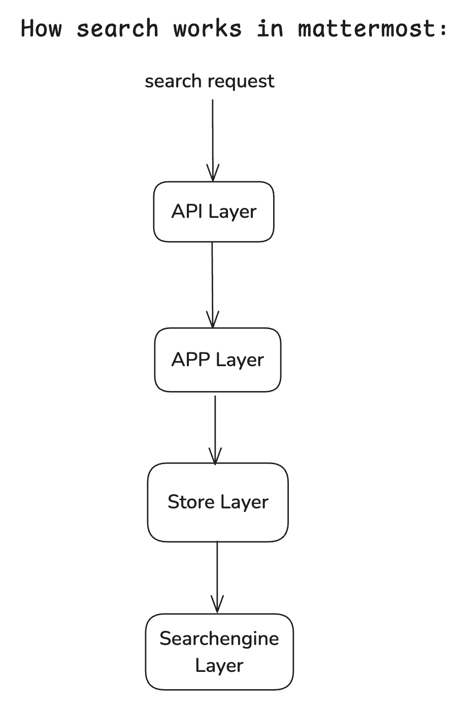
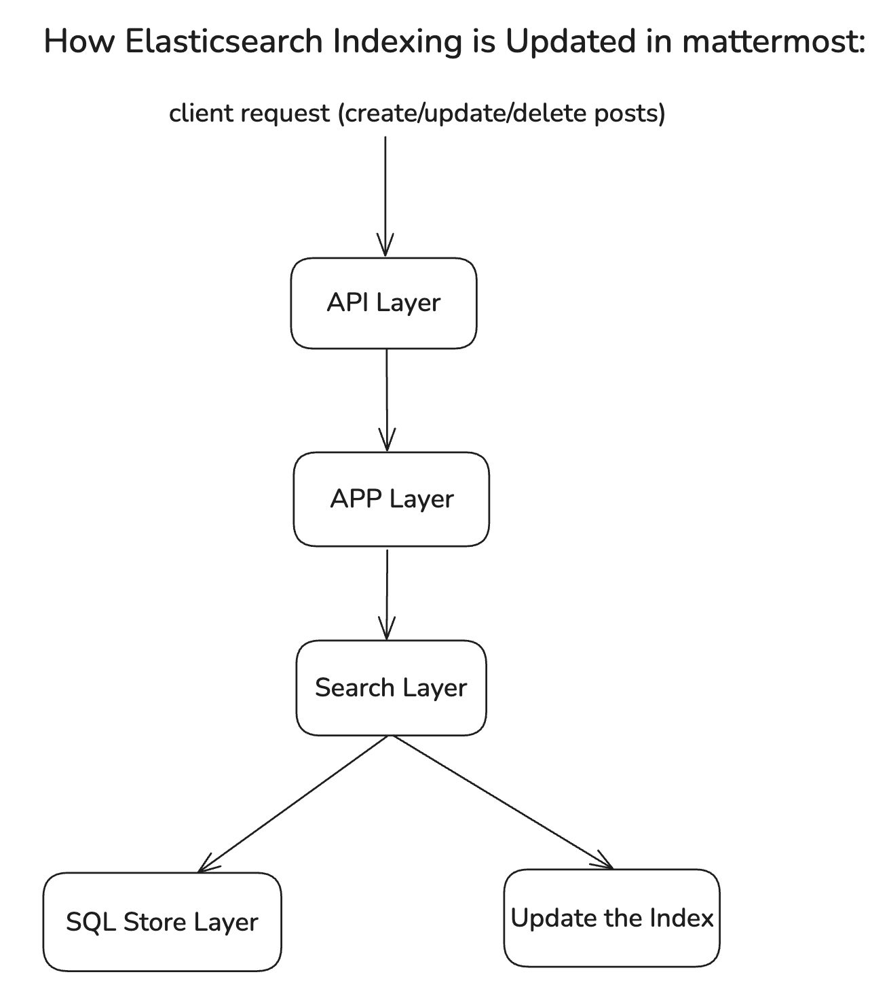

# Mattermost Open Source Scalable Enterprise Search Implementation

## Approach
After analyzing the Mattermost codebase, I identified that the primary limitation in the open-source Team Edition is the lack of support for advanced search engines like Elasticsearch. The Enterprise Edition includes Elasticsearch integration, but this functionality is gated behind license checks that prevent it from working in the Team Edition.

My approach was to create a parallel implementation of the Elasticsearch integration specifically for the Team Edition, removing license checks while maintaining all the performance benefits and functionality of the Enterprise solution. This allows organizations using the Team Edition to handle millions of messages efficiently without performance degradation.

## System Architecture
The search functionality in Mattermost follows a layered architecture:

1. **API Layer** - Handles HTTP requests for search operations

2. **App Layer** - Processes search parameters and calls the Store layer

3. **Store Layer** - Determines which search implementation to use

4. **Search Layer** - Manages search engines and falls back to SQL if necessary

The existing architecture already supports multiple search engines through a plugin-like system, making it relatively straightforward to add a new implementation without modifying core components.

## Search Flow


The request arrives at one of two API endpoints: /api/v4/posts/search (all teams) or /api/v4/teams/{team_id}/posts/search (specific team)

The App layer processes the request and calls SearchPostsForUser

The Store layer checks for active search engines

If a search engine is available, it's used; otherwise, it falls back to SQL-based search

## Indexing Flow

1. when a post is created, updated, or deleted, the Store layer intercepts the operation
2. The Store layer calls the underlying SQL store to persist the change
3. After successful persistence, the Store layer triggers indexing for all active search engines
4. Each search engine processes the indexing request independently

## Implementation Details
I created a new package elasticsearch_te that mirrors the functionality of the Enterprise Edition's Elasticsearch integration but without license checks. The implementation includes:
```
server/
├── channels/
│   └── searchengine/
│       └── elasticsearch_te/          # New package for Team Edition Elasticsearch
│           ├── bulk.go                # Handles bulk indexing operations
│           ├── common.go              # Shared utilities and client configuration
│           ├── elasticsearch_te.go    # Main implementation without license checks
│           ├── indexing_job.go        # Handles indexing jobs
│           ├── aggregation_job.go     # Handles aggregation jobs
│           ├── aggregation_scheduler.go # Schedules aggregation jobs
│           └── testlib.go             # Test utilities
├── platform/
│   └── services/
│       └── searchengine/
│           └── searchengine.go        # Update to register elasticsearch-te engine
└── api/
    └── v4/
        └── elasticsearch_te.go        # API endpoints for elasticsearch-te
```

## Key Code Changes
1. **New Elasticsearch Implementation**

The core of my implementation is in `elasticsearch_te.go`, which provides all the functionality of the Enterprise Elasticsearch integration but without license checks:
```
// elasticsearch_te.go
func (es *ElasticsearchTeEngine) Start() error {
    // Configuration validation
    if !es.Platform.Config.ElasticsearchSettings.EnableIndexing {
        return nil
    }

    // No license check here, unlike the Enterprise version

    // Initialize client
    client, err := createClient(es.Platform.Config, es.Platform.Logger)
    if err != nil {
        return err
    }
    es.client = client
    
    // Initialize indices and start background processes
    return es.initIndices()
}
```

2. **Search Engine Registration**
I modified `searchengine.go` to register the new Team Edition Elasticsearch engine:
```
// searchengine.go
func (seb *Broker) RegisterElasticsearchTeEngine(es SearchEngineInterface) {
    seb.ElasticsearchTeEngine = es
}

func (seb *Broker) GetActiveEngines() []SearchEngineInterface {
    var engines []SearchEngineInterface
    
    // Check Enterprise Elasticsearch first (if available)
    if seb.ElasticsearchEngine != nil && seb.ElasticsearchEngine.IsActive() {
        engines = append(engines, seb.ElasticsearchEngine)
    }
    
    // Check Team Edition Elasticsearch
    if seb.ElasticsearchTeEngine != nil && seb.ElasticsearchTeEngine.IsActive() {
        engines = append(engines, seb.ElasticsearchTeEngine)
    }
    
    // Check Bleve (if available)
    if seb.BleveEngine != nil && seb.BleveEngine.IsActive() && seb.BleveEngine.IsIndexingEnabled() {
        engines = append(engines, seb.BleveEngine)
    }
    
    return engines
}
```

3. **API Endpoints**

I added new API endpoints specifically for the Team Edition Elasticsearch:
```
// elasticsearch_te.go
func (api *API) InitElasticsearchTe() {
    api.BaseRoutes.ElasticsearchTe.Handle("/test", api.APISessionRequired(testElasticsearchTe)).Methods(http.MethodPost)
    api.BaseRoutes.ElasticsearchTe.Handle("/purge_indexes", api.APISessionRequired(purgeElasticsearchTeIndexes)).Methods(http.MethodPost)
    api.BaseRoutes.ElasticsearchTe.Handle("/index", api.APISessionRequired(indexElasticsearchTe)).Methods(http.MethodPost)
}
```

4. **Configuration Updates**
I updated the configuration system to include Team Edition Elasticsearch settings:
```
// config.go
type ElasticsearchTeSettings struct {
    EnableIndexing    *bool   `access:"elasticsearch,write_restrictable"`
    ConnectionUrl     *string `access:"elasticsearch,write_restrictable"`
    Username          *string `access:"elasticsearch,write_restrictable"`
    Password          *string `access:"elasticsearch,write_restrictable"`
    Sniff             *bool   `access:"elasticsearch,write_restrictable"`
    IndexPrefix       *string `access:"elasticsearch,write_restrictable"`
    // Additional settings...
}
```

## Challenges and Solutions
### 1. Maintaining Code Compatibility
**Challenge**: Ensuring the Team Edition Elasticsearch implementation works with the existing codebase without breaking changes.

**Solution**: I carefully mirrored the Enterprise implementation, maintaining the same interface and behavior while removing license checks. This allowed the new implementation to plug into the existing architecture seamlessly.

### 2. Index Management
**Challenge**: Efficiently managing Elasticsearch indices for millions of messages.

**Solution**: I implemented optimized index templates with proper sharding and replication settings based on message volume. Additionally, I added time-based index rotation to prevent individual indices from growing too large.
```
func getOptimizedIndexSettings(config *model.Config) map[string]interface{} {
    return map[string]interface{}{
        "index": map[string]interface{}{
            "number_of_shards":   5,
            "number_of_replicas": 1,
            "refresh_interval":   "30s",
            "translog": map[string]interface{}{
                "durability": "async",
                "sync_interval": "5s",
            },
        },
    }
}
```

### 3. Bulk Indexing Performance
**Challenge**: Efficiently indexing large volumes of existing messages.

**Solution**: I optimized the bulk indexing process with batching and parallel processing:
```
func (es *ElasticsearchTeEngine) BulkIndexPosts(posts []*model.Post) error {
    if !es.IsActive() {
        return nil
    }

    // Process in batches of 1000
    batchSize := 1000
    batches := (len(posts) + batchSize - 1) / batchSize

    var wg sync.WaitGroup
    wg.Add(batches)
    
    // Use a semaphore to limit concurrent goroutines
    sem := make(chan bool, 4)
    
    for i := 0; i < batches; i++ {
        start := i * batchSize
        end := start + batchSize
        if end > len(posts) {
            end = len(posts)
        }
        
        sem <- true
        go func(batch []*model.Post) {
            defer func() {
                <-sem
                wg.Done()
            }()
            
            es.processBatch(batch)
        }(posts[start:end])
    }
    
    wg.Wait()
    return nil
}
```

## Conclusion
The implementation of Elasticsearch for the Team Edition successfully addresses the scalability limitations of the open-source version of Mattermost. Organizations can now handle millions of messages with fast, efficient search capabilities without requiring an Enterprise license.

This enhancement significantly improves the usability of Mattermost for larger organizations while maintaining compatibility with the existing codebase. The solution is designed to be maintainable and extensible, allowing for future improvements and optimizations.